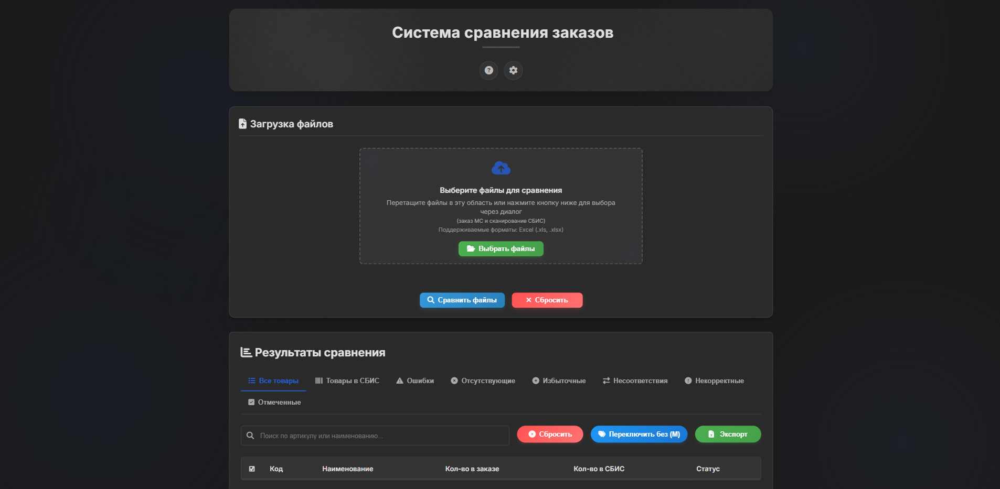
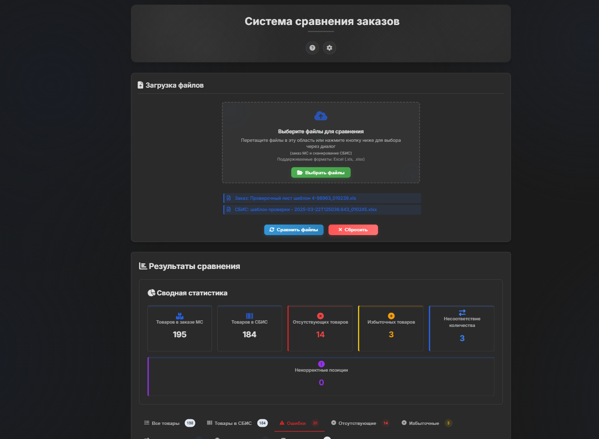

# CrossCheck PRO

## 📋 Описание

**CrossCheck PRO** — мощное профессиональное решение для быстрой и точной сверки данных между системами СБИС и кассовыми аппаратами. 

> ✨ **Оптимизируйте бизнес-процессы** с интеллектуальным анализом, который мгновенно выявляет несоответствия, обнаруживает отсутствующие позиции и находит расхождения в количестве товаров.

Благодаря интуитивному интерфейсу и продуманной логике, CrossCheck PRO экономит ваше время и повышает эффективность учёта товаров, делая сложные проверки простыми и быстрыми.

## 🖼️ Скриншоты

### Главное окно анализа

### Результаты сверки

## 🚀 Основные возможности

- **🔄 Два режима работы:** СБИС и КАССА
- **🔍 Комплексный анализ данных:** выявление отсутствующих, лишних и несоответствующих позиций
- **📊 Интуитивный интерфейс:** удобная работа с результатами сверки через систему вкладок
- **🔎 Фильтрация и сортировка:** быстрый поиск нужной информации
- **✓ Отметки товаров:** возможность отмечать проверенные позиции
- **📤 Экспорт в Excel:** сохранение результатов для дальнейшей обработки
- **🎨 Настраиваемый интерфейс:** несколько тем оформления, масштабирование

## 🏁 Начало работы

1. **Выберите режим работы** (СБИС или КАССА) в верхней части окна
2. **Загрузите файлы** для анализа через кнопку или перетащив их в область загрузки
   - Для режима СБИС: загрузите файлы из МС и СБИС
   - Для режима КАССА: загрузите файл из МС и введите данные из кассы в текстовое поле
3. **Нажмите кнопку "Анализировать"** для запуска сверки
4. **Изучите результаты** по категориям в соответствующих вкладках:
   - Все товары
   - Товары в СБИС/КАССЕ
   - Ошибки
   - Отсутствующие
   - Избыточные
   - Несоответствия
   - Некорректные
   - Отмеченные
5. **Используйте фильтрацию и сортировку** для удобного анализа результатов
6. **Экспортируйте результаты** в Excel при необходимости

## 💻 Системные требования

- **Windows:** Windows 10 или новее (64-бит)
- **macOS:** macOS 10.13 или новее
- **Linux:** Ubuntu 16.04 или новее, Fedora 24 или новее
- **Оперативная память:** 4 ГБ (рекомендуется 8 ГБ)
- **Процессор:** 1.6 ГГц и выше
- **Свободное место на диске:** 100 МБ

## 📜 Лицензия

CrossCheck PRO распространяется под лицензией MIT. Подробности в файле [LICENSE](LICENSE).

## 👨‍💻 Разработчик

© 2025 [@Fr1z1ck](https://t.me/Fr1z1ck). Все права защищены. 